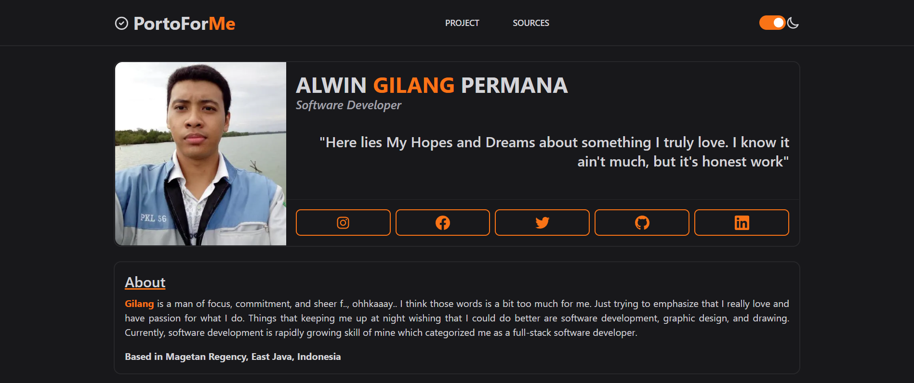

# PortoForMe

> My Personal Portofolio Website.
> Live demo [_here_](https://www.example.com). <!-- If you have the project hosted somewhere, include the link here. -->

## Table of Contents

-   [Technologies Used](#technologies-used)
-   [Screenshots](#screenshots)
-   [Setup](#setup)
-   [Usage](#usage)
-   [Project Status](#project-status)
-   [Contact](#contact)
<!-- * [License](#license) -->

## Technologies Used

-   NextJS
-   TailwindCSS

## Screenshots

<!-- If you have screenshots you'd like to share, include them here. -->

## Setup

This project require [Node.js](https://nodejs.org/) to run.

## Usage

Clone this repo and run in development

`npm run dev`

## Project Status

Project is: _complete_ with ongoing improvement.

To do:

-   Add CMS for project section

## Contact

Created by [@al-gilang-p](https://portoforme.vercel.app/) - feel free to contact me!

<!-- Optional -->
<!-- ## License -->
<!-- This project is open source and available under the [... License](). -->

<!-- You don't have to include all sections - just the one's relevant to your project -->
